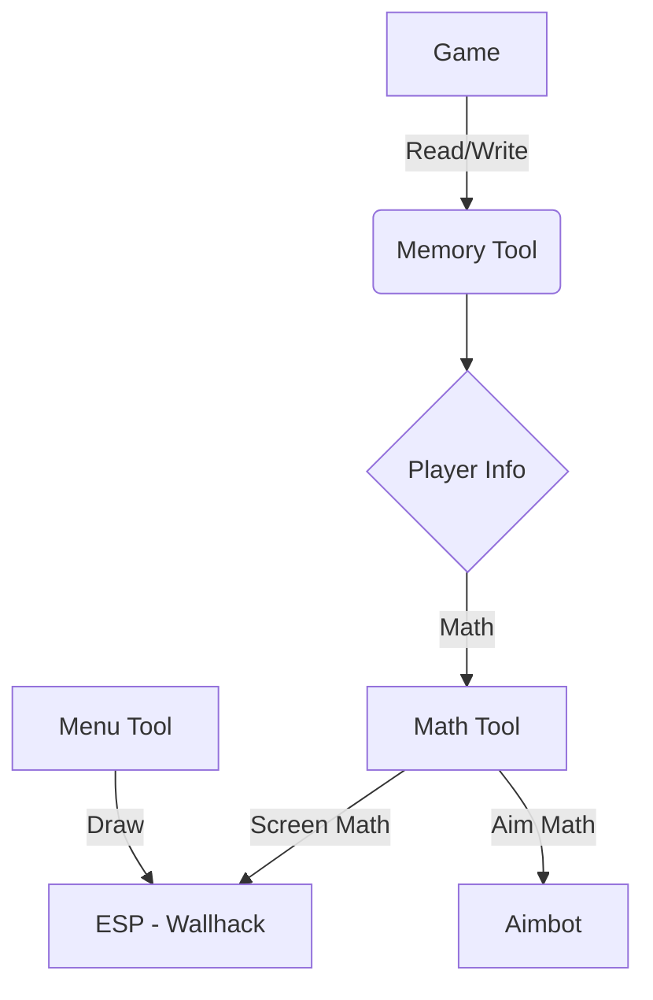
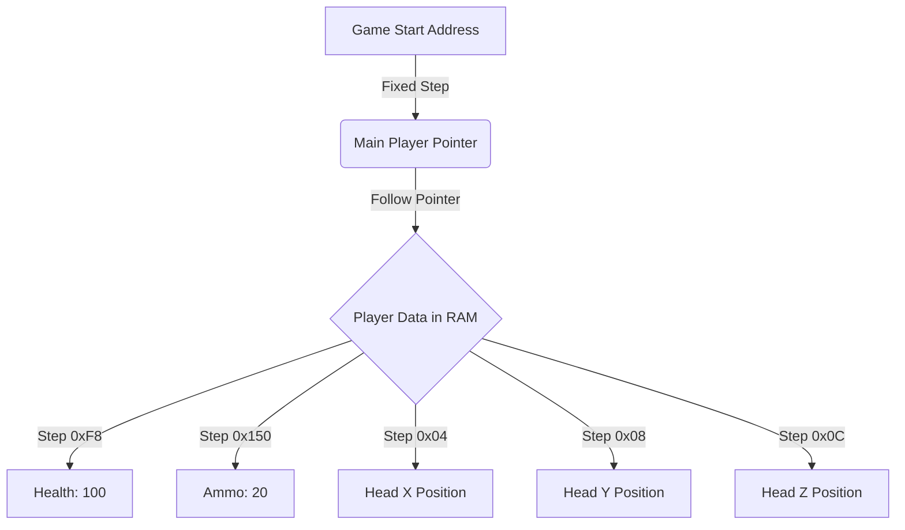
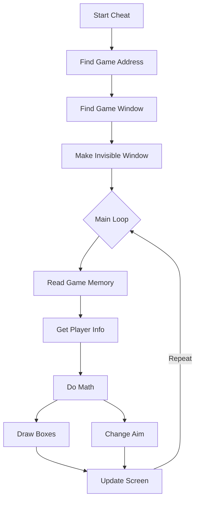

TITLE: Assault Cube Cheat (aimbot + esp) linux + windows
CATEGORY: Cheats
DATE: 2026-05-23
IMAGE: https://avatars.githubusercontent.com/u/5957666?s=280&v=4

---

# Building a Game Cheat for AssaultCube

AssaultCube is a fun game. It is also very easy to hack! It has no anti-cheat. This makes it a great playground to learn how game cheats work.

I built a cheat for this game. It works on Windows and Linux. The cheat has two main features:

- **ESP**: This lets you see enemies through walls.
- **Aimbot**: This aims the gun for you automatically!

Let's see how I did it in a very simple way!

---

## 1. How is it built?

Before writing code, we need a plan. My project has two parts:

- `linux-version/` runs on Linux.
- `win-version/` runs on Windows.

I also wrote some shared code to do the hard work:

- `mem.hpp`: This reads and writes to the game's memory.
- `player.hpp`: This stores info about the players, like their health.
- `vector2.hpp` & `vector3.hpp`: This does the math to aim the gun.
- `imgui/`: This draws the nice menu over the game.

---

## 2. Finding Secret Numbers

Games save everything in the computer's memory (RAM). When you play AssaultCube, it puts data in RAM. Some data moves around. Some data stays in the same place.

### Finding the Health Value

We want to find our health in the memory.

1. Open a tool called Cheat Engine and attach it to the game.
2. Search for `100` because that is your starting health.
3. Hurt yourself in the game! Now your health is lower, maybe `85`.
4. Search for `85` in Cheat Engine.
5. Repeat this until you find the exact spot holding your health.

### Finding the Player Pointer

The health address moves around every time you restart the game. We need to find a "Base Pointer". This is a permanent map to the player's info!

1. Right-click the health address in Cheat Engine.
2. Click "Find out what writes to this address".
3. Hurt yourself again. Cheat Engine shows you the code making the change.
4. This code uses a "pointer" and a step called an "offset".
5. We trace this pointer back to the game's start. This permanent path is our "Base Pointer"!

### Finding the View Matrix

To draw boxes around enemies (ESP), we need the "View Matrix". It helps convert the 3D game world into a flat 2D screen.

1. The View Matrix is a group of numbers changing as you move your mouse.
2. We search for numbers that go between `1.0` and `-1.0` when we look straight up and down.
3. Once we find these numbers, we can use them to draw on the screen accurately!

---

## 3. The Code

### Start Cheat

The program starts here. It sets up everything.

### Find Game Address

We find where the game is in the computer's memory. The start address changes every time, so we must find it first.

### Find Game Window

We find out exactly where the game is on your screen. Our cheat needs to line up perfectly with the game window.

### Make Invisible Window

We make a clear window over the game. We draw our ESP boxes and menu on this invisible window.

### Read Game Memory

We read the bad guys' positions using the permanent pointers we found.

### Get Player Info

We grab the health and location for every player in the game.

### Do Math

Math helps us find where enemies are! We do two main math tricks.

**1. Aim Math (Angles):**
Imagine pointing your finger at a toy.
Your arm moves left or right. This is called the "Yaw" angle.
Your arm moves up or down. This is called the "Pitch" angle.
To find these, we measure the distance between us and the bad guy.
We draw an invisible triangle between us and them.
A math tool called "trigonometry" looks at this triangle.
It tells us exactly how much to turn our head to look right at them!

$$
Yaw = \text{Left/Right Turn}
$$

$$
Pitch = \text{Up/Down Turn}
$$

**2. Screen Math (World-to-Screen):**
The game world is big and 3D. But your computer monitor is a flat 2D screen.
How do we draw a flat box over a 3D person?
We use the "View Matrix" camera trick we found earlier!
It squishes the 3D world flat onto your screen.
It tells us the exact pixel on your monitor where the bad guy is standing.
Then, we know exactly where to draw our box!

### Draw Boxes & Change Aim

We draw boxes on the clear window. We write new angles into the game memory to make our player look right at the enemy!

### Repeat!

The cheat loops extremely fast so it always uses the newest info to keep aiming and drawing!
